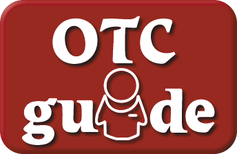

<!-- PROJECT LOGO -->
 

  <h3 align="center">Informing Consumers on their Over-The-Counter Options</h3>

  
 
    <a href="https://youtu.be/XC9IIhvAeLU">View Demo</a>
    ·
    <a href="https://github.com/feliceforgione/otcGuide/issues">Report Bug</a>
    ·
    <a href="https://github.com/feliceforgione/otcGuide/issues">Request Feature</a>
  

<!-- ABOUT THE PROJECT -->

## About The Project

 

### Aids the consumer in choosing appropriate over-the-counter options. With the demands on pharmacists increasing and more stores selling over-the-counter products without a pharmacist on site, consumers are left on their own to choose from the growing number of over-the-counter selections.

 

## Built With

|                                   |                                                 |                                            |
| --------------------------------- | :---------------------------------------------: | -----------------------------------------: |
| [Next.js 13](https://nextjs.org/) |         [Prisma 5](https://prisma.io/)          |            [MySQL](https://www.mysql.com/) |
| [SWR](https://swr.vercel.app/)    |   [NextAuth.js 4](https://next-auth.js.org/)    |    [TailwindCSS](https://tailwindcss.com/) |
| [Docker](https://www.docker.com/) | [TypeScript 5](https://www.typescriptlang.org/) | [Zustand 4](https://zustand-demo.pmnd.rs/) |
|                                   |                                                 |

 

# Features

- Utilizes disease classes, a brief medical history, and various clinical-based questions to lead the consumer in the
  right direction
- Provides guidance about over-the-counter products
- Informs consumers on non-pharmacologic options
- Help consumers eliminate the confusion that comes from the vast array of product choices and misleading marketing messages.
- Detailed information for each over-the-counter product including: large 360-degree panoramic image of the product and enlarged easy-to-read replication of the product label

### Criteria Used

- Medical history - Age, Gender, Pregnancy, Nursing
- Disease State Contraindications and Ingredient/Product Contraindications
- Disease tree algorithm based on symptoms and patient current health status
- Ingredient filter questions
- Ingredient allergies

 

## Roadmap

- [ ] Complete algorithm data
- [ ] Multi-language Support

 

See the [open issues](https://github.com/feliceforgione/otcGuide/issues) for a full list of proposed features (and known issues).

 

<!-- CONTRIBUTING -->

## Contributing

Contributions are what make the open source community such an amazing place to learn, inspire, and create. Any contributions you make are **greatly appreciated**.

If you have a suggestion that would make this better, please fork the repo and create a pull request. You can also simply open an issue with the tag "enhancement".
Don't forget to give the project a star! Thanks again!

1. Fork the Project
2. Create your Feature Branch (`git checkout -b feature/AmazingFeature`)
3. Commit your Changes (`git commit -m 'Add some AmazingFeature'`)
4. Push to the Branch (`git push origin feature/AmazingFeature`)
5. Open a Pull Request

 
<!-- CONTACT -->

## Contact

Felice Forgione - [@forgione67](https://twitter.com/forgione67)

Project Link: [https://github.com/feliceforgione/otcGuide](https://github.com/feliceforgione/otcGuide)
